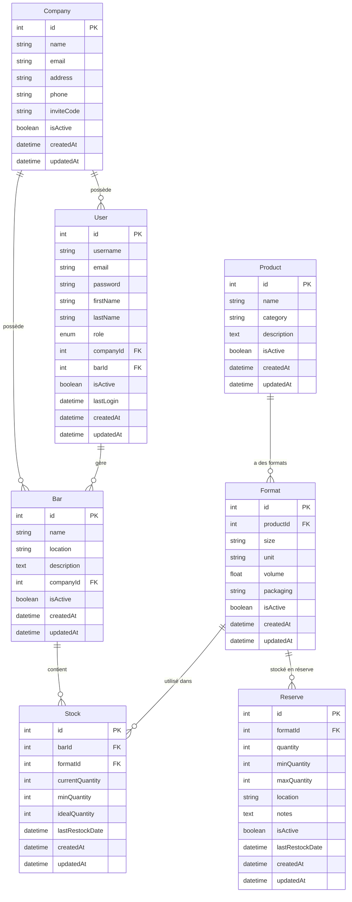

# 📊 SCHÉMA DES ÉCHANGES AVEC LA BASE DE DONNÉES

## 🗄️ **STRUCTURE DE LA BASE DE DONNÉES**



---

## 🔄 **FLUX D'INSCRIPTION ADMIN + ENTREPRISE**

### **1. Frontend → Backend**
```javascript
POST /api/auth/register-with-company
Content-Type: application/json

{
  "username": "roman",
  "email": "roman@gmail.com", 
  "password": "motdepasse123",
  "firstName": "Roman",
  "lastName": "Lerat",
  "company": {
    "name": "Mon Bar",
    "email": "contact@monbar.com",
    "address": "123 Rue du Bar"
  }
}
```

### **2. Backend → Base de données (Transaction)**

#### **Étape 2.1: Vérification utilisateur existant**
```sql
SELECT * FROM Users 
WHERE username = 'roman' OR email = 'roman@gmail.com';
```
Si trouve → Erreur 400: "Utilisateur existe déjà"

#### **Étape 2.2: Vérification entreprise existante**
```sql
SELECT * FROM Companies 
WHERE name = 'Mon Bar';
```
Si trouve → Erreur 400: "Entreprise existe déjà"

#### **Étape 2.3: Créer l'entreprise**
```sql
INSERT INTO Companies (name, email, address, isActive, inviteCode, createdAt, updatedAt)
VALUES ('Mon Bar', 'contact@monbar.com', '123 Rue du Bar', true, 'A1B2C3D4', NOW(), NOW());
```
→ Récupère `companyId = 4`

#### **Étape 2.4: Créer l'utilisateur admin**
```sql
INSERT INTO Users (username, email, password, firstName, lastName, role, companyId, isActive, createdAt, updatedAt)
VALUES ('roman', 'roman@gmail.com', '$2b$10$hashedpassword', 'Roman', 'Lerat', 'admin', 4, true, NOW(), NOW());
```
→ Récupère `userId = 6`

#### **Étape 2.5: Commit transaction**
```sql
COMMIT;
```

### **3. Backend → Frontend (Réponse)**
```json
{
  "success": true,
  "message": "Entreprise et compte administrateur créés avec succès !",
  "data": {
    "user": {
      "id": 6,
      "username": "roman",
      "email": "roman@gmail.com",
      "firstName": "Roman",
      "lastName": "Lerat", 
      "role": "admin",
      "companyId": 4,
      "isActive": true
    },
    "company": {
      "id": 4,
      "name": "Mon Bar",
      "inviteCode": "A1B2C3D4"
    }
  }
}
```

---

## 🔐 **FLUX DE CONNEXION**

### **1. Frontend → Backend**
```javascript
POST /api/auth/login
{
  "username": "roman",
  "password": "motdepasse123"
}
```

### **2. Backend → Base de données**
```sql
SELECT u.*, c.name as companyName, b.name as barName
FROM Users u
LEFT JOIN Companies c ON u.companyId = c.id  
LEFT JOIN Bars b ON u.barId = b.id
WHERE u.username = 'roman';
```

### **3. Vérifications**
- Utilisateur existe ? ✅
- Mot de passe correct ? ✅ (bcrypt.compare)
- Compte actif ? ✅

### **4. Génération Token JWT**
```javascript
const token = jwt.sign({
  id: user.id,
  username: user.username,
  role: user.role,
  companyId: user.companyId
}, JWT_SECRET, { expiresIn: '24h' });
```

### **5. Mise à jour dernière connexion**
```sql
UPDATE Users SET lastLogin = NOW() WHERE id = 6;
```

---

## 📊 **FLUX DASHBOARD (Multi-tenant)**

### **1. Récupération entreprises**
```javascript
GET /api/companies
Authorization: Bearer JWT_TOKEN
```

```sql
-- Si role = 'admin'
SELECT * FROM Companies WHERE id = {user.companyId};

-- Si role = 'superuser'  
SELECT * FROM Companies WHERE isActive = true;
```

### **2. Récupération bars**
```javascript
GET /api/bars?companyId=4
```

```sql
SELECT * FROM Bars 
WHERE companyId = 4 AND isActive = true
ORDER BY name ASC;
```

### **3. Récupération stocks**
```javascript
GET /api/stocks?companyId=4
```

```sql
SELECT s.*, f.size, f.packaging, p.name as productName, b.name as barName
FROM Stocks s
JOIN Formats f ON s.formatId = f.id
JOIN Products p ON f.productId = p.id  
JOIN Bars b ON s.barId = b.id
JOIN Companies c ON b.companyId = c.id
WHERE c.id = 4;
```

---

## 🚨 **DIAGNOSTIC PROBLÈME FRONTEND**

### **Test API fonctionnel ✅**
```bash
node debug-inscription-backend.js
→ Status: 201 Created
→ Entreprise créée: Test Enterprise Roman
→ Code: 5E94215E1444FE84
```

### **Problème identifié: Frontend**
1. **JavaScript non lié** ou données mal formatées
2. **Nom d'entreprise déjà existant** 
3. **Validation côté client échoue**

### **Solution**
1. Vérifier `login.html` → JavaScript
2. Tester avec noms uniques
3. Vérifier console navigateur pour erreurs 